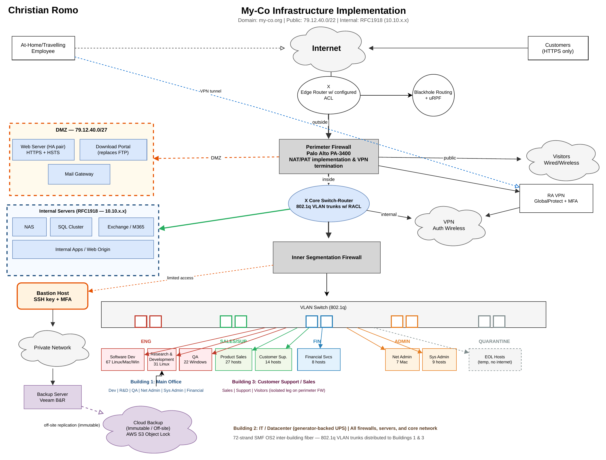

# My-Co Secure Infrastructure Redesign

I did this project in spring 2026 as the final project for COMP 348 (Network Security). My-Co is a fictional technology company with three office buildings in Lake County, Illinois, and it had just suffered a break-in and a data loss event that led to account compromises and the destruction of proprietary R&D data. I was hired (on paper) to redesign their infrastructure so it could not happen again.

The company was leaving a completely open environment, meaning there was no firewall, every server and desktop sat on one flat network, and everything had a public IP address. The assignment gave a list of ten identified risks and asked for a logical drawing of the new design plus solutions to five of them. I picked five solutions, and because I wanted a layered approach where one change fixes more than one problem, they end up covering seven of the ten risks.

> The assignment and the original diagram belong to the course. The original diagram is shown below only as the "before" picture, and everything else in this repo is my own work.

## The Scenario

Several of My-Co's core services (file storage, email, and databases) were running on end-of-life hardware and software, the web server was on aging hardware with no redundancy, the backup tapes were stored in the same room as the backup server, remote employees had no secure way in, and many of the desktops were running operating systems that no longer get security patches.


*The original infrastructure, from the course assignment.*

## My Design


*My proposed logical design. The editable source is [`myco-proposed.drawio`](myco-proposed.drawio) and a PDF copy is [`myco-proposed-diagram.pdf`](myco-proposed-diagram.pdf).*

> The diagram is exactly as I submitted it, so a few labels differ from the corrected write-up below: the DMZ is labeled `79.12.40.0/27` (the write-up uses `79.12.40.32/27`, since the original range overlapped the ISP link), the Software Development box says 67 hosts (the assignment lists 109, which is 67 Linux, 21 Windows, and 21 Mac), and the bastion host is drawn outside the DMZ box even though the write-up places it in the DMZ.

### How I approached it

Before I drew anything, I wrote down the layers I wanted: a perimeter firewall at the edge, a segmentation firewall inside, a DMZ for anything public, a bastion host for administrators, an off-network backup server, and blackhole routing with uRPF on the edge router. My class notes also reminded me that only one perimeter firewall was needed, since there is already plenty of fiber connecting the three buildings, meaning the firewall could sit in the Building 2 datacenter and the internal networks could be distributed to the other buildings over the existing cabling.

I also kept in mind that putting too many barriers inside a network hurts collaboration, so I split the internal network by how people actually work instead of giving every department its own wall.

### Which risks each solution covers

| My solution | Assignment risks addressed |
|---|---|
| 1. Perimeter firewalls, DMZ, and an HTTPS download portal | Risk 1 (no perimeter protection), Risk 6 (web server resilience, through the HA pair), and Risk 9 (outdated FTP) |
| 2. Internal segmentation | Risk 2 (no internal segmentation) |
| 3. Backups | Risk 7 (backup tapes stored on-site) |
| 4. Secure remote access | Risk 8 (no secure remote access) |
| 5. EOL client systems | Risk 10 (EOL client systems) |

---

## Solution 1: Adding Perimeter Protection Firewalls for Servers and Desktops

In the current design, there's only a single edge router that connects all servers and desktops directly to the internet, with no firewall in between. Servers sit on publicly routable addresses (79.12.40.0/22) with nothing inspecting or filtering traffic before it reaches them.

My solution is to deploy a perimeter firewall (Palo Alto PA-3400) in Building 2's datacenter, between the edge router and all internal networks. The edge router keeps its ISP point-to-point (79.12.40.0/30) and is configured with uRPF in strict mode to drop spoofed source addresses, ingress ACLs to reject RFC1918-sourced and internally sourced inbound traffic, and blackhole routing for known malicious IP ranges.

The perimeter firewall creates a DMZ on a small public subnet (79.12.40.32/27) to hold public-facing services such as the web server (now in an HA pair with HTTPS and HSTS), an HTTPS download portal that replaces the insecure FTP server (addressing Risk 9), and an inbound mail gateway. All other servers (NAS, SQL, Exchange, internal apps) are moved behind the perimeter firewall onto RFC1918 private addresses (10.10.x.x) and only reach the internet via NAT/PAT for outbound patching and updates. The perimeter firewall also terminates the VPN service for remote employees, and visitors from Building 3 are placed on a separate public-facing firewall leg with PAT to the internet and no access to internal resources.

This major architectural change solves the perimeter protection gap, creates the DMZ needed to separate public-facing from internal servers, and retires the FTP service by replacing it with an HTTPS portal.

## Solution 2: Segmenting the Internal Network

In the current design, all servers and desktops share the same flat network. The desktop subnet (79.12.42.0/23) holds each department's machines on the same broadcast domain with no barriers between them, including WinXP systems in Financial and Customer Support sitting alongside development machines and servers. This is what allowed the original breach to move laterally and destroy Research and Development data.

My solution is to deploy an inner segmentation firewall behind a VLAN-aware switch-router (Cisco Catalyst 9500/9300), using 802.1q trunks and RACLs per VLAN to divide the network by role and collaboration needs. The inner firewall inspects east-west traffic and stops lateral movement between segments.

| VLAN | Who is on it | Why |
|---|---|---|
| Engineering | Software Development, Research and Development, and Quality Assurance | They share a development-to-testing workflow |
| Sales/Support | Product Sales and Customer Support | Co-located in Building 3 with similar customer-facing needs |
| Financial | Financial Services | Sensitivity of its data |
| Admin | Network Administration and System Administration | Privileged access, with all server access going through the bastion host |
| Quarantine | EOL machines that can't be immediately replaced | No internet access and only scoped application access through the inner firewall |

Internal servers (NAS, SQL, Exchange) are placed on their own server VLAN on RFC1918 addressing. Host-based firewalls are enabled on every desktop to protect against lateral movement at the host level. VLANs are distributed to Buildings 1 and 3 over the existing 72-strand single-mode fiber runs using 802.1q trunks, so no new inter-building cabling is needed.

## Solution 3: Addressing On-site Backups

In the current design, IBM Tivoli is used for backups with tapes stored in the same physical room as the backup server. A single incident such as a fire, flood, or ransomware that reaches the backup server destroys both production data and the backups at the same time.

My solution is to replace Tivoli with Veeam Backup & Replication and move the backup server onto a private, isolated network with no direct inbound access from any user VLAN. The backup server connects to production servers through the inner firewall on only the specific ports needed for backup jobs, and nothing else. On-site tape is retired entirely.

For off-site protection, Veeam replicates backups to an immutable cloud repository such as AWS S3 with Object Lock or Azure Blob with an immutable storage policy. This provides air-gap-equivalent storage, even if the on-prem backup server is compromised. The backup server is the only host permitted outbound to the cloud target, and only over TLS to specific endpoints. The only management access path to the backup server is through the bastion host via SSH with key-based authentication, following the same pattern used for all admin access to internal servers.

## Solution 4: Enabling Secure Remote and Travel Access to the Corporate Environment

In the current design, at-home and travelling employees have no defined way to securely reach internal resources. There is no VPN, no MFA, and no bastion host, meaning any remote access would require exposing services like RDP or SSH directly to the internet.

My solution is to deploy Palo Alto GlobalProtect VPN on the perimeter firewall with multi-factor authentication via Microsoft Authenticator. Remote employees connect through the VPN, authenticate with their credentials plus MFA, and are placed into the same firewall zone as their on-site VLAN. A Sales employee connecting from home gets the same access and the same restrictions as if they were sitting at their desk in Building 3.

For administrators who need access to server management interfaces and network equipment, a bastion host is deployed in the DMZ as the single entry point. Admin staff SSH into the bastion using key-based authentication plus MFA, and from there access internal servers and management consoles via SOCKS5 proxy or SSH port-forwarding through the inner firewall. No management port is exposed directly to the internet or to general user VLANs.

## Solution 5: Providing Isolation for EOL Client Systems

In the current design, the desktop environment includes WinXP machines in Financial and Customer Support, Win7 machines in Sales and Customer Support, CentOS 6 and Ubuntu 16.04 in Software Development, and Solaris in System Administration. None of these receive security patches, many have known remote-code-execution vulnerabilities, and all of them sit on the same flat network as everything else.

My solution is to upgrade hardware and operating systems across all of these groups.

| Group | Current | Replacement |
|---|---|---|
| Financial Services (8 machines) | WinXP | New hardware running Windows 11 Pro |
| Customer Support (14 machines) | WinXP/Win7 | New hardware running Windows 11 Pro |
| Product Sales (27 machines) | Win7 | Windows 11 Pro |
| Software Development | CentOS 6 and Ubuntu 16.04 | Rocky 9 or Ubuntu 24.04 LTS |
| Research and Development | CentOS 7 | Rocky 9 |
| System Administration | Solaris | Debian 12 or Ubuntu 24.04 LTS |

Any machine that cannot be immediately replaced is moved to the Quarantine VLAN established in Solution 2, which has no internet access and only allows traffic to specific application servers through the inner firewall. Host-based firewalls are enabled on all refreshed desktops to block unnecessary inbound connections and protect against lateral movement at the host level. Machines stay in quarantine until they are replaced or their workload is migrated.

---

## Skills Used

Network security architecture, perimeter and internal firewall design, DMZ design, network segmentation (VLANs, 802.1q, RACLs), uRPF and blackhole routing, VPN and MFA design (GlobalProtect), bastion host design, backup and disaster recovery planning (Veeam, immutable cloud storage), EOL system remediation planning, hardware and software selection, logical network diagramming (draw.io), technical writing

## What I Learned

**One change can fix more than one problem.** The perimeter firewall alone handled the missing perimeter, the DMZ, and the replacement of FTP, which is a lot more efficient than three separate fixes.

**Segmentation has to match how people work.** Splitting the network too far would hurt collaboration, so I grouped departments by workflow (Development, R&D, and QA together) instead of walling off every team.

**Backups only help if the attacker cannot reach them.** Moving the backup server to an isolated network and keeping an immutable cloud copy means ransomware that gets in still cannot take the backups with it.

**Administrators need their own path in.** A bastion host with key-based authentication and MFA gives them one controlled way to reach the servers, meaning no management port is exposed to the internet or to the general user VLANs.

`[closing line: something honest about what was hardest, or what you would do differently]`

## Repo Contents

```
.
├── README.md
├── myco-proposed.drawio
├── myco-proposed-diagram.pdf
└── images/
    ├── myco-assigned-diagram.png
    └── myco-proposed-diagram.png
```
